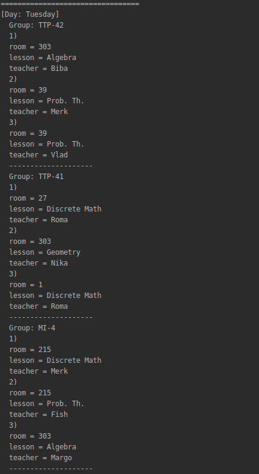

# class-scheduling-csp

Solving Class Scheduling problem using the CSP method.

###Input:
At **main.cpp** you can manually create any of objects:
- Group
- Teacher
- Room
- Subject
- Day

###Used heuristics:
- Forward Checking
- Minimum Remaining Values Heuristic
- Degree Heuristic
- Least Constraining Value Heuristic

The most powerful heuristic was the combination of __Forward Checking__
and **Minimum Remaining Values Heuristic**.

Also, I added a couple of small optimization like considering only non-used variables,
storing the pointer to object instead of copying it. Also using set and map C++ data structures to optimize look-up, finding, or
erasing objects.

### Testing:

Because CSP solver works pretty fast due to constraining (5 days, 4 lessons, 4 groups, 9 subjects, 6 rooms, 8 teachers).
I've run solver 100 times using **profile.h** file to measure the time.
Least Constraining Value Heuristic showed itself the worse, probably it's because of small constraining and selected CSP
variables and domains.
 
### Output:

Example of the part of the generated output:

Monday                        |  Tuesday
:----------------------------:|:---------------------------------:
 |  

You can see the first line: